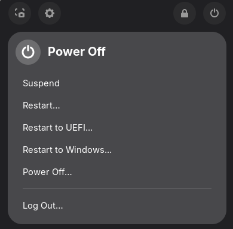

# Extra Reboot Options

This is a small Gnome extension that adds the ability to reboot directly to a dualbooted Windows install or the UEFI firmware.

Currently the Windows option is hardcoded to boot into `auto-windows`, the auto-detected default for `systemd-boot`.

This is a fork of UbayGD's wonderful [Reboot to UEFI extension](https://github.com/UbayGD/reboottouefi) (also available in [GNOME Extensions](https://extensions.gnome.org/extension/5105/reboottouefi/)).

### Build and install the extension

Requirements:

- make
- nodejs and npm
- gettext

To build the extension run the following command:

`$ make pack`

If all goes well this will generate a zip file in the project folder.

To install the extension just run the following command:

`$ make install`
